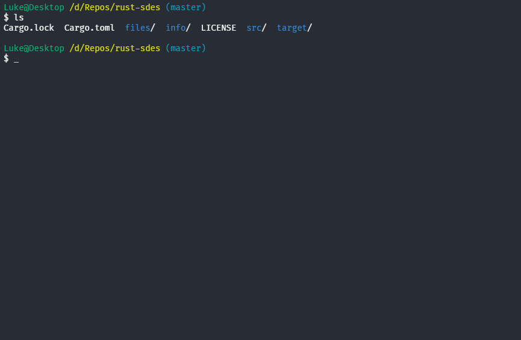
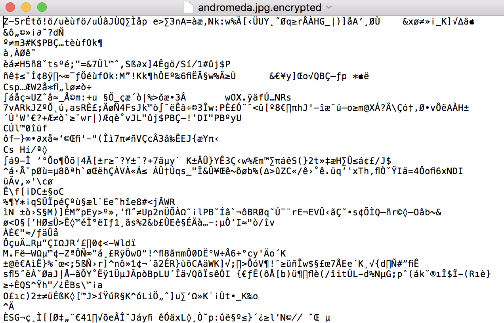
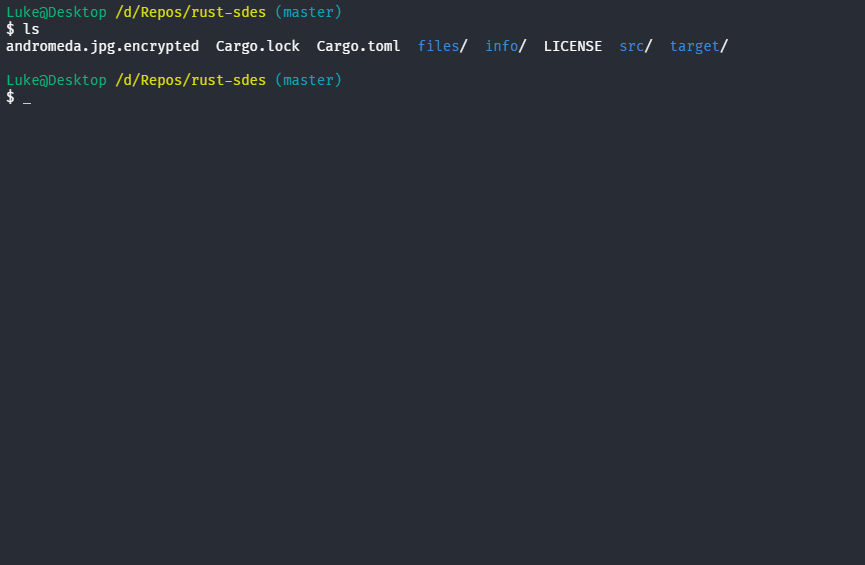

# Rust Simplified Data Encryption Standard (SDES)
### for learning purposes

Program runs with Cipher Block Chaining (CBC) mode.

To better understand how the encryption algorithm and cbc work:

- `./info/cbc.pdf`
- `./info/s-des.pdf`

### Usage:
Clone the program and run it with cargo (Rust's package manager)

Both parties: sending (encrypting), and receiving (decrypting), need to securely share a 10-digit binary symmetric key, and an 8-digit binary initialization vector. If the key, initialization vector, and file match, encryption and decryption should work for any type of file.

#### Run the program with the following arguments:
Encryption:

`cargo run <key> <vector> <plaintext_filename> <ciphertext_filename>`

Decryption:

`cargo run <d> <key> <vector> <ciphertext_filename> <plaintext_filename>`

## Example:

### File: andromeda.jpg (plaintext)

### Encrypting `./files/andromeda.jpg` with key `0111111101` and initialization vector: `10101010`:

### File: andromeda.jpg.encrypted (ciphertext)
File is now meaningless to image viewers, opening it produces this:

### Decrypting file `./andromeda.jpg.encrypted` with key `0111111101` and initialization vector: `10101010`:

Produces the original file. I tried to write the code as close to the description of the algorithm as possible for the sake of readability.

P.S.: This program is for learning purposes only, this encryption can be easily broken, so do not rely on it for important files!